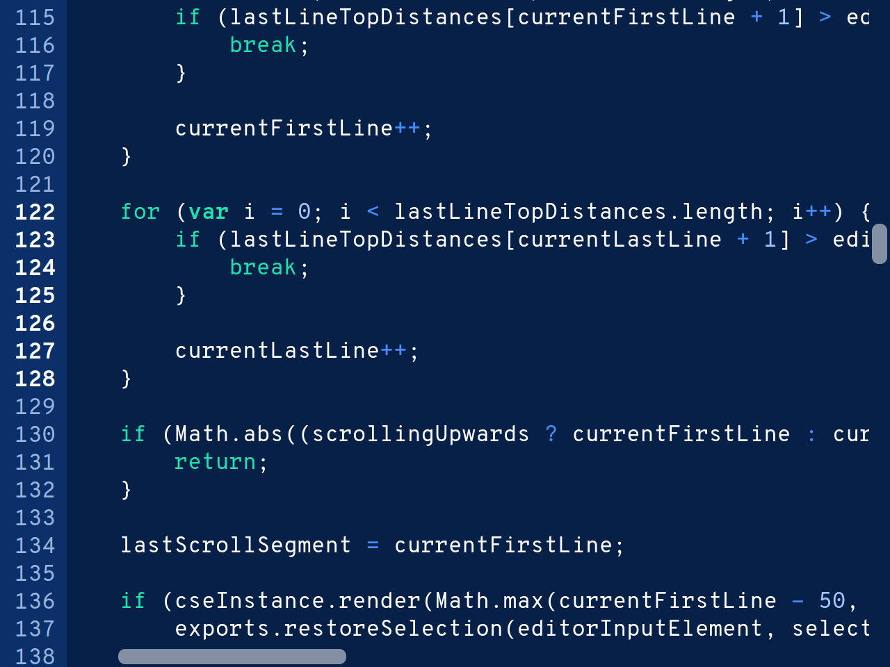

# Codeslate Engine
A powerful, embeddable code editor for web projects.

Licenced by the [Subnodal Open-Source Licence](LICENCE.md).

<p align="center">
    <br>
    <i>The Codeslate Engine in use, with the default theme and JavaScript language mode</i>
</p>

## About Codeslate Engine
Codeslate Engine is a lightweight code editor built using web technologies and
[subModules](https://github.com/Subnodal/subModules). It has zero third-party
dependencies and does not pollute the scope when used alongside JavaScript and
CSS. Codeslate Engine also features great accessibility and mobile support,
which is lacking in other third-party HTML5 code editor implementations.

## Features
* Support for multiple languages, with RegEx-able syntax definitions
* Customisable with many themes, definable using colour + CSS rules
* Multiline indentation and unindentation using Tab key
* Automatic indentation when opening or closing block statements
* Editor preference fully configurable (whether you like to indent using 4
  spaces, 2 spaces, 4-space tabs, 8-space tabs... We'll support it!)
* Dynamic loading and unloading of syntax highlighting to improve performance
* Spellchecking in strings only (or other syntax definitions with `spellcheck`
  set to `true`), using browser's spellchecker

## Supported languages
* JavaScript

Feel free to contribute your language! Language definitions belong in the
`languages/` directory.

## Themes
* Dark (default)
* Light
* High Contrast Dark
* High Contrast Light
* Solarized Dark
* Solarized Light

Feel free to contribute your theme! Themes belong in the `themes/` directory.

## Getting Codeslate Engine
Importing Codeslate Engine into your project is simple! Just add this line to
the `<head>` of your HTML code (you can also host the `csengine.min.js` file
yourself):

```html
<script src="https://cdn.subnodal.com/lib/csengine.min.js"></script>
```

## Building
To build Codeslate Engine, you must have
[subPack](https://github.com/Subnodal/subPack). If you have it, run in the main
directory:

```bash
$ subpack
```

You should then have the bundled and minified version of Codeslate Engine in
`build/csengine.min.js`.